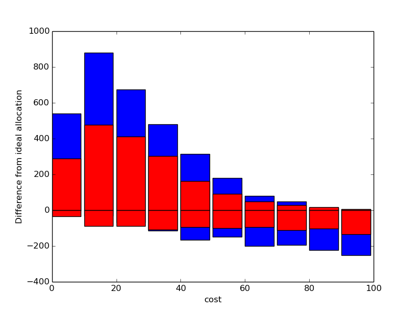

# Mecanismos de voto para presupuestos participativos

Los sistemas de votación para elegir presupuestos participativos tienen una complejidad añadida sobre los sistemas de voto de elección de representantes: cada opción tiene un coste económico diferente. Esto aumenta la complejidad para el votante, y también introduce una serie de efectos no deseados en algunos métodos de votación [1].

Voto simple: cada votante vota un número fijo de proyectos. Es el mecanismo más simple, pero genera desigualdad, ya que el voto de quienes votan proyectos caros vale más que el de quienes votan proyectos de bajo coste.

Recuento sensitivo al coste: Similar al voto simple, pero en el recuento cada proyecto es puntuado según el número de votos recibidos dividido entre su coste. Elimina la desigualdad anterior, pero dificulta la posibilidad de elegir proyectos de elevado coste, ya que es necesario que muchas más personas se pongan de acuerdo para sacarlos adelante.

Voto acumulativo: los votos valen según el coste de los proyectos. Un votante tiene una cantidad de presupuesto para votar a repartir entre diferentes proyectos.

Voto transferible: permite transferir votos de proyectos descartados a otros que sí pueden ser elegidos. Por ejemplo, el mecanismo de segunda vuelta instantánea (*instant runoff voting*) elimina secuencialmente las propuestas con menos votos y transfiere sus votos a las siguientes preferencias.

[1] http://www.accuratedemocracy.com/p_need2.htm