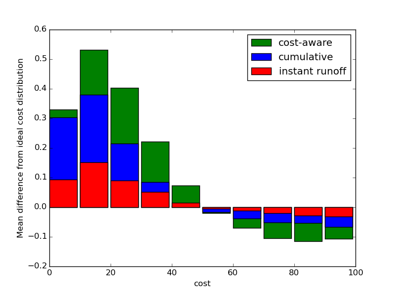

# Mecanismos de voto para presupuestos participativos

## Sistemas de voto: ventajas y desventajas

Los sistemas de votación para elegir presupuestos participativos tienen una complejidad añadida sobre los sistemas de voto de elección de representantes: cada opción tiene un coste económico diferente. Esto aumenta la complejidad para el votante, y también introduce una serie de efectos no deseados en algunos métodos de votación [1].

Voto simple: cada votante vota un número fijo de proyectos. Es el mecanismo más simple, pero genera desigualdad, ya que el voto de quienes votan proyectos caros vale más que el de quienes votan proyectos de bajo coste.

Recuento sensitivo al coste: Similar al voto simple, pero en el recuento cada proyecto es puntuado según el número de votos recibidos dividido entre su coste. Elimina la desigualdad anterior, pero dificulta la posibilidad de elegir proyectos de elevado coste, ya que es necesario que muchas más personas se pongan de acuerdo para sacarlos adelante.

Voto acumulativo: los votos valen según el coste de los proyectos. Un votante tiene una cantidad de presupuesto para votar a repartir entre diferentes proyectos.

Voto transferible: permite transferir votos de proyectos descartados a otros que sí pueden ser elegidos. Por ejemplo, el mecanismo de segunda vuelta instantánea (*instant runoff voting*) elimina secuencialmente las propuestas con menos votos y transfiere sus votos a las siguientes preferencias. Como contrapartida, se aumenta la complejidad a la hora de votar.

## Comparativa

Durante los últimos años, uno de los sistemas más efectivos de presupuestos participativos ha sido el programa Betri Hverfi en Reikjavík [2], a través de una plataforma online de votación mediante un sistema de voto acumulativo. La interfaz de la página, similar a entornos de compra por internet, permite a cada ciudadano "gastar" su presupuesto en los proyectos que decida, recibiendo feedback visual de la distribución del presupuesto [3] y por tanto promoviendo un efecto pedagógico al hacer más consciente al usuario del coste de los proyectos y las limitaciones del presupuesto.

Nuestro objetivo es comprobar la eficacia del sistema de voto cumulativo comparativamente con otros sistemas, y explorar la posibilidad de mejorar el sistema mediante algún sistema de voto preferencial.

Para ello, simulamos un proceso de votación con $$N_p=10$$ proyectos y $$Nv=1000$$ votantes

Figura 1

[1] http://www.accuratedemocracy.com/p_need2.htm

[2] Lackaff, D., Grimsson, G., & Bjarnason, R. (2014). Better Reykjavik: Municipal Policycrafting from the Autonomous Grassroots.

[3] https://docs.google.com/presentation/d/12RZZG2M3sCYP7-uBhpyI7MytzwLsumXgWcgfpxPewrY/edit#slide=id.g12d2c70d0_06 (p.28)

[3] https://github.com/rbjarnason/open-active-voting/blob/master/app/models/budget_vote_counting.rb