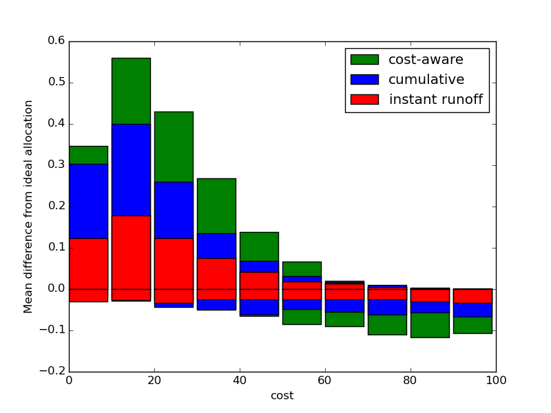

# Mecanismos de voto para presupuestos participativos

## Sistemas de voto: ventajas y desventajas

Los sistemas de votación para elegir presupuestos participativos tienen una complejidad añadida sobre los sistemas de voto de elección de representantes: cada opción tiene un coste económico diferente. Esto aumenta la complejidad para el votante, y también introduce una serie de efectos no deseados en algunos métodos de votación [1].

Voto simple: cada votante vota un número fijo de proyectos. Es el mecanismo más simple, pero genera desigualdad, ya que el voto de quienes votan proyectos caros vale más que el de quienes votan proyectos de bajo coste.

Recuento sensitivo al coste: Similar al voto simple, pero en el recuento cada proyecto es puntuado según el número de votos recibidos dividido entre su coste. Elimina la desigualdad anterior, pero dificulta la posibilidad de elegir proyectos de elevado coste, ya que es necesario que muchas más personas se pongan de acuerdo para sacarlos adelante.

Voto acumulativo: los votos valen según el coste de los proyectos. Un votante tiene una cantidad de presupuesto para votar a repartir entre diferentes proyectos.

Voto transferible: permite transferir votos de proyectos descartados a otros que sí pueden ser elegidos. Por ejemplo, el mecanismo de segunda vuelta instantánea (*instant runoff voting*) elimina secuencialmente las propuestas con menos votos y transfiere sus votos a las siguientes preferencias. Como contrapartida, se aumenta la complejidad a la hora de votar.

## Comparativa

Durante los últimos años, uno de los sistemas más efectivos de presupuestos participativos ha sido el programa Betri Hverfi en Reikjavík [2], a través de una plataforma online de votación mediante un sistema de voto acumulativo [4]. La interfaz de la página, similar a entornos de compra por internet, permite a cada ciudadano "gastar" su presupuesto en los proyectos que decida, recibiendo feedback visual de la distribución del presupuesto [3] y por tanto promoviendo un efecto pedagógico al hacer más consciente al usuario del coste de los proyectos y las limitaciones del presupuesto.

Nuestro objetivo es comprobar la eficacia del sistema de voto cumulativo comparativamente con otros sistemas, y explorar la posibilidad de mejorar el sistema mediante algún sistema de voto preferencial.

Para ello, simulamos un proceso de votación con $$N_p=16$$ proyectos (similar a las votaciones de Reikjavik) y $$Nv=1000$$ votantes y $$C$$ presupuesto disponible (diferentes valores se han testeado con resultados similares). Cada proyecto tiene un valor de coste y otro de preferencia (cómo de deseable es ese proyecto, incluyendo su coste). El coste de cada proyecto $$p$$ es definido como $$c_p=\mathcal{U}_p$$, donde $$\mathcal{U_p}$$ es un entero aleatorio distribuido uniformemente en un rango $$[1,100]$$. La preferencia de cada proyecto $$f_p = \mathcal{N}.$$, donde $$\mathcal{N_p}$$ es un valor aleatorio producido por una distribución gaussiana con media cero y varianza uno.
A pesar de existir un valor de preferencias comunes, cada votante tiene su propias preferencias para cada proyecto, calculadas como $$f_{p,v} = f_p + \mathcal{N}_{p,v}$$.

Los votantes votarán proyectos en orden según sus preferencias hasta agotar los votos o el presupuesto disponible.

Probaremos tres sitemas de votación:
* Voto sensitivo al coste: cada votante podrá votar hasta cuatro proyectos de cualquier coste. El valor de cada voto se divide entre el coste del proyecto a la hora del recuento.
* Voto acumulativo: cada votante podrá votar proyectos hasta acabar con el presupuesto disponible $$C$$
* Voto acumulativo transferible: cada votante podrá votar proyectos hasta acabar con $$k$$ veces el presupuesto disponible $$C$$. Los proyectos hasta un valor $$C$$ se considerarán como la primera opción del votante, y a partir de ese momento y hasta alcanzar un valor de $$k\cdot C$$, los proyectos se considerarán como la segunda opción del votante. Para calcular los votos se utiliza un método de segunda vuelta instantánea, en el que los proyectos con menos votos son utilizados, y sus votos son transferidos a proyectos elegidos como segunda opción. Utilizamos un valor de $$k=1.5$. Valores más altos tienen resultados ligeramente mejores, pero por elegimos un valor pequeño debido a que presentaría una modificación más ligera en la experiencia del votante respecto al voto acumulativo.

Cada sistema de votación lo compararemos con una distribucion ideal del presupuesto. Dado que conocemos las preferencias iniciales de cada proyecto $f_p$, elegiremos la distribucion de proyectos que tiene una mayor valor acumulado de preferencia ajustándose al presupuesto disponible.

Para cada sistema de votación, realizamos 5000 simulaciones y las comparamos con la distribución ideal.

En primer lugar, calculamos la distribución de proyectos elegidos según su coste, mediante un histograma de 10 valores, y comparamos la distribución ideal con los diferentes sistemas, obteniendo los resultados mostrados en la Figura  1. Como podemos ver, todos los sistemas sobrerrepresentan a los proyectos con valores más pequeños. Sin embargo, la distancia respecto a la distribución ideal es mucho más pequeña en el sistema de voto preferencial que en las otras dos, mejorando considerablemente su funcionamiento.

Figura 1.

En segundo lugar, calculamos el número de proyectos que resultan elegidos en según cada sistema que no son elegidos en la distribución ideal en cada rango de coste, representándolos en el eje positivo de la Figura 2. Calculamos también el número de proyectos que resultan elegidos en la distribución ideal pero no en el sistema de votación, representándolos en el eje negativo de la Figura 2. De nuevo, vemos que el sistema de voto prefencial es muy superior a los otros dos, teniendo una distribución mucho más cercana a la ideal.

Figura 2.

[1] http://www.accuratedemocracy.com/p_need2.htm

[2] Lackaff, D., Grimsson, G., & Bjarnason, R. (2014). Better Reykjavik: Municipal Policycrafting from the Autonomous Grassroots.

[3] https://docs.google.com/presentation/d/12RZZG2M3sCYP7-uBhpyI7MytzwLsumXgWcgfpxPewrY/edit#slide=id.g12d2c70d0_06 (p.28)

[4] https://github.com/rbjarnason/open-active-voting/blob/master/app/models/budget_vote_counting.rb, línea 135