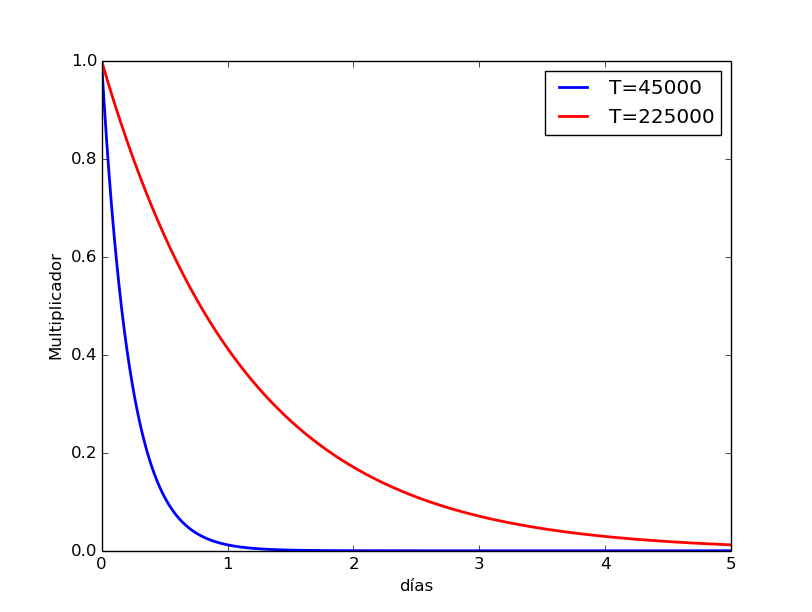

## Algoritmos de filtrado colaborativo

### Algoritmo de reddit

```
cpdef double _hot(long ups, long downs, double date):
    """The hot formula. Should match the equivalent function in postgres."""
    s = score(ups, downs)
    order = log10(max(abs(s), 1))
    if s > 0:
        sign = 1
    elif s < 0:
        sign = -1
    else:
        sign = 0
    seconds = date - 1134028003
    return round(sign * order + seconds / 45000, 7)
    
 ```
 
 El algorítmo de Reddit está diseñado para que el contenido se renueve de forma más o menos diaria, 
 de forma que el número de puntos de cada propuesta se divide entre 10 cada 12 horas aproximadamente 
 (es decir, en 1 día su valor se divide entre 100). Esta dinámica está controlada por un parámetro de decaimiento $T$ que en el código de arriba es igual a 45000.
 Para procesos con dinámicas más largas, simpemente habría que modificar el parámetro con valor 45000 en el algoritmo.
 Por ejemplo, sustituyendo la fórmula final por `return round(sign * order + seconds / 225000, 7)`, una propuesta con
 5 días de antiguedad necesitaría 5 días para que su valor se dividiera entre 100.
 
 
 Figura 1. Comparación del decaimiento de la puntuación para diferentes parametros de $T$. En azul, la configuración del algoritmo tal y como la usa reddit, ajustado para un periodo de unas 12 horas, y en rojo, el algorimto ajustado para una temporalidad más larga de 60 horas.
 
 #Altoritmos de ordenación de propuestas según consenso

### Positivos menos negativos

Es el más simple. Simplemente resta el número de votos positivos y negativos y ordenar de mayor a menor.
El problema es que no captura exactamente el consenso de una propuesta. 
Una propuesta con 10 positivos y 1 negativo tiene el mismo número de puntos que una propuesta con 100 positivos y 99 negativos.

### Porcentaje de positivos

Otra opción simple es calcular el porcentaje de positivos de cada propuesta y ordenar de mayor a menor.
El problema es que no captura la cantidad de apoyo de cada propuesta.
Una propuesta con 5 positivos tendría más puntos que una propuesta con 100 positivos y 10 negativos.

### Consenso aproximado

Una opción que recoge lo mejor de las dos anteriores es calcular tanto la cantidad de apoyo como el porcentaje de positivos.
En plataformas para encontrar propuestas de consenso como las utilizadas por Zaragoza en Común o Ahora Madrid se utilizó la siguiente fórmula:
```
def consenso(ups, downs)
  return log2(ups+downs) * ((ups-downs)/(ups+downs))
```
La fórmula que hace es calcular la fracción de votos positivos, y multliplicarlo por el logaritmo base dos del número de votos. El log2(ups+downs) hace que cada vez que la propuesta tiene el doble de votos que otra se suma un punto. Así, si tenemos una propuesta con 100 votos y 90% de positivos, se considera más de consenso que p.ej. una propuesta con 5 votos y 100% de positivos.


  
  [0] https://github.com/reddit/reddit/blob/c6f959504466333c0d7d51c131240473aaf78b04/r2/r2/lib/db/_sorts.pyx
  
